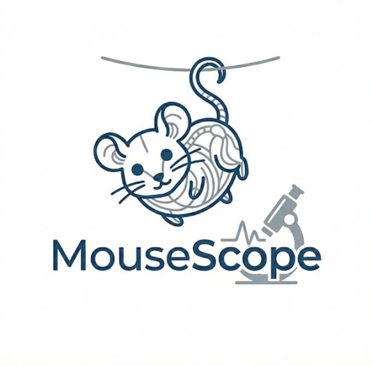

# 🐭 MouseScope

<p align="center">
  
</p>

<p align="center">
  <b>Automated Mouse Tail Suspension Test (TST) Analysis Software</b><br>
  小鼠悬尾实验自动化分析软件
</p>

<p align="center">
  
  
  
  
  
</p>

---

## 📖 Overview | 项目简介

**MouseScope** is a fully automated analysis tool for the **Mouse Tail Suspension Test (TST)**, a widely used behavioral assay in neuroscience research to evaluate depression-like phenotypes.

**MouseScope** 是一款专为小鼠悬尾实验（TST）设计的全自动化分析工具，用于神经科学研究中抑郁样行为表型的评估。

**Key Features | 核心功能：**

- 🎯 **Automated Immobility Detection** — Computer vision-based tracking, no manual scoring
  全自动不动性检测，无需人工评分
- 📹 **Video Upload & Processing** — Supports common video formats (MP4, AVI, MOV)
  支持主流视频格式上传与批量处理
- 🔲 **Interactive ROI Calibration** — Flexible Region of Interest selection
  可交互的感兴趣区域（ROI）标定
- 📊 **Multi-format Output** — CSV data tables + detailed analysis reports
  多格式输出：CSV 数据表 + 详细分析报告
- 🖥️ **Desktop GUI** — Browser-based interface, no coding required
  基于浏览器的桌面 GUI，零代码门槛
- ⚡ **High Performance** — Multi-core CPU optimization, optional OpenCV CUDA acceleration
  多核 CPU 优化，可选 OpenCV CUDA 加速

---

## 🛠️ Technical Stack | 技术栈

| Component | Technology |
|-----------|-----------|
| Backend | Python 3.9+, Flask |
| Computer Vision | OpenCV, Optical Flow, Background Subtraction |
| Optional AI | YOLOv11-seg (Ultralytics) |
| Data Processing | NumPy, Pandas |
| Frontend | HTML5, CSS3, Vanilla JS |
| Packaging | PyInstaller (Windows EXE) |

**Algorithm Pipeline | 算法流程：**

```
Video Input → ROI Calibration → Background Subtraction
    → Morphological Processing → Mouse Detection
    → Optical Flow Analysis → Immobility Classification
    → Report Generation (CSV + TXT)
```

---

## 📸 Demo & Screenshots | 演示与界面展示

### 🎬 Complete Tutorial | 完整使用教程

<p align="center">
  
  <br>
  <em>📹 Complete workflow demonstration: Upload → Calibrate → Analyze → Export</em><br>
  <em>📹 完整工作流演示：上传 → 标定 → 分析 → 导出</em>
</p>

---

### 🔬 Analysis Results | 分析结果展示

<p align="center">
  
  <br>
  <em>🎯 Automated tracking with immobility detection visualization</em><br>
  <em>🎯 自动追踪与不动性检测可视化</em>
</p>

---

## 🚀 Quick Start | 快速上手

### Option 1: Pre-built EXE (Windows) | 方式一：直接使用 EXE

1. Download `MouseScope.zip` from [Releases](../../releases)
2. Extract and double-click `MouseScope.exe`
3. Browser opens automatically at `http://localhost:8080`

### Option 2: Run from Source | 方式二：从源码运行

```bash
# Clone the repository
git clone https://github.com/fujiacheng3/MouseScope.git
cd MouseScope

# Install dependencies
pip install -r requirements.txt

# Run
python app.py
```

Then open `http://localhost:8080` in your browser.


---

## 📋 Usage Workflow | 使用流程

```
1. Upload Video     →  上传实验视频（MP4 / AVI / MOV）
2. Calibrate ROI    →  框选单只小鼠区域
3. Start Analysis   →  自动运行 CV 分析
4. Download Report  →  下载 CSV + 分析报告
```

### Output Files | 输出文件

| File | Content |
|------|---------|
| `*_logs.csv` | Frame-by-frame tracking data 逐帧追踪数据 |
| `*_immobility.csv` | Immobility statistics 不动性统计 |
| `*_report.txt` | Full analysis report 完整分析报告 |

---

## 📐 System Requirements | 系统要求

- **OS**: Windows 10 / 11 (x64)
- **RAM**: ≥ 8 GB recommended
- **CPU**: Multi-core (4+ cores recommended for faster processing)
- **Storage**: ≥ 500 MB free space
- **Python**: 3.9 – 3.11 (for source mode)

---

## ⚠️ Disclaimer | 免责声明

**Important Notice | 重要提示：**

This software is provided as a **research tool** to assist in behavioral analysis. While we strive for accuracy, **results should be manually verified** before use in publications or critical decisions.

本软件作为**研究辅助工具**提供。虽然我们力求准确，但**结果应经人工核验**后方可用于论文发表或重要决策。

**Limitations | 使用限制：**
- ⚠️ **Accuracy not guaranteed** — Algorithm performance may vary with video quality, lighting conditions, and experimental setup
  算法准确率不保证 — 性能受视频质量、光照条件和实验设置影响
- ⚠️ **Manual validation required** — Always cross-check automated results with manual observation
  需人工验证 — 务必将自动化结果与人工观察交叉核对
- ⚠️ **For research use only** — Not intended for clinical diagnosis or regulatory submissions
  仅供研究使用 — 不适用于临床诊断或监管申报

**No Warranty | 无担保条款：**

THIS SOFTWARE IS PROVIDED "AS IS", WITHOUT WARRANTY OF ANY KIND. The authors assume no liability for any damages resulting from the use of this software.

本软件按"现状"提供，不提供任何形式的担保。作者不对使用本软件造成的任何损失承担责任。

---

## 📚 Citation | 引用说明

If you use MouseScope in your research, **please cite**:

如果您在研究中使用了本软件，**请务必引用**：

> 📌 **Note**: When reporting results in publications, please mention that automated data were manually validated.
>
> 📌 **注意**：在论文中报告结果时，请说明自动化数据已经过人工验证。

```bibtex
@software{fu2026mousescope,
  author  = {Fu, Jiacheng (付家丞)},
  title   = {MouseScope: Automated Mouse Tail Suspension Test Analysis Software},
  year    = {2026},
  url     = {https://github.com/fujiacheng3/MouseScope},
  version = {1.0}
}
```

**Plain text format | 纯文本格式：**

> Fu, J. (2026). *MouseScope: Automated mouse tail suspension test analysis software* (Version 1.0) [Software]. GitHub. https://github.com/fujiacheng3/MouseScope

---

## ⚖️ License | 许可证

This software is **free for academic and non-commercial use only**.

本软件**仅供学术研究和非商业用途免费使用**。

| Use Case | Allowed |
|----------|---------|
| Academic research 学术研究 | ✅ Free |
| Educational use 教学使用 | ✅ Free |
| Publication (with citation) 发表论文（需引用） | ✅ Free |
| Commercial use (Proprietary) 商业使用（闭源） | ⚠️ License required |
| Enterprise internal use 企业内部使用 | ⚠️ License required |
| CRO / pharma companies CRO/制药公司 | ⚠️ License required |

For commercial licensing, please contact the author.
如需商业授权，请联系作者。

See [LICENSE](LICENSE) for full terms.

---

## 📬 Contact | 联系方式

**Author | 作者**: 付家丞 (Jiacheng Fu)

**Email**: 2583348593@qq.com

**For commercial licensing | 商业合作**: Please email with subject line `[MouseScope Commercial License]`

---

## 🙏 Acknowledgements | 致谢

Built with:
- [OpenCV](https://opencv.org/) — Computer vision library
- [Flask](https://flask.palletsprojects.com/) — Web framework
- [Ultralytics YOLOv11](https://github.com/ultralytics/ultralytics) — Optional AI backbone

---

<p align="center">
  Made with ❤️ for the neuroscience research community<br>
  为神经科学研究社区用心打造
</p>
